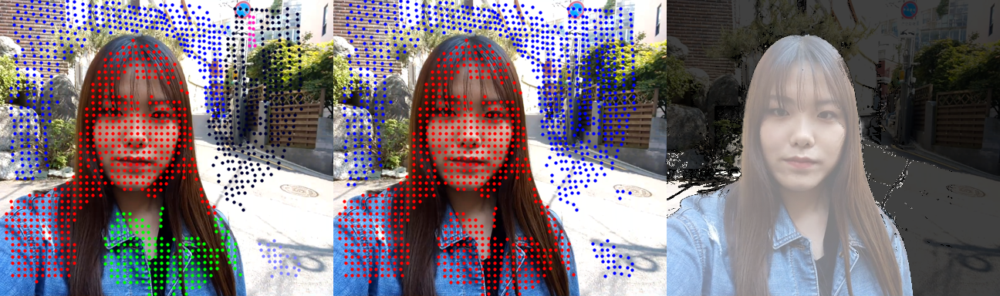

# Foreground Extraction via Dual-Side Cameras

This repository is the implementation of the following paper:

```
@article{lu2019foreground,
  title={Foreground extraction via dual-side cameras on a mobile device using long short-term trajectory analysis},
  author={Lu, Yucheng and Kim, Dong-Wook and Kim, Sesong and Jung, Seung-Won},
  journal={Image and Vision Computing},
  year={2019},
  publisher={Elsevier}
}
```

It is provided for research purposes only, if you use it in your research, please cite our paper.

### Third-party dependencies

This repository requires several third-party dependencies from various authors, which are all included in "thirdParty" folder. They are:

- Large displacement optical flow from Thomas Brox et. al.;
- Dense point trajectories from N. Sundaram et. al.;
- Optical flow visualization untils from Daniel Scharstein;
- Color chart visualization samples from Tim Holy;
- Bilateral space video segmentation from Nicolas Maerki et. al.

### Dataset details

The dataset used in the paper can be downloaded from Google drive [here](https://drive.google.com/file/d/1_FZgLkKVdhseVltq0_IiOS2GjhMc36oS/view?usp=sharing). Please check "motionType.txt" for descriptions of each sample clip. 

### How to use

Simply download the dataset and unzip it to "dataset" folder, or use your own video clips. Then run "DEMO.m" to perform foreground segmentation. If the input is a video, it will first separate dual-camera images and save them as PNG files. Please note that the pictures of some devices are mirrored and thus need to be flipped back again.

Below is an example output as the combination of initial labeling result, semi-dense classification, and final dense segmentations:

